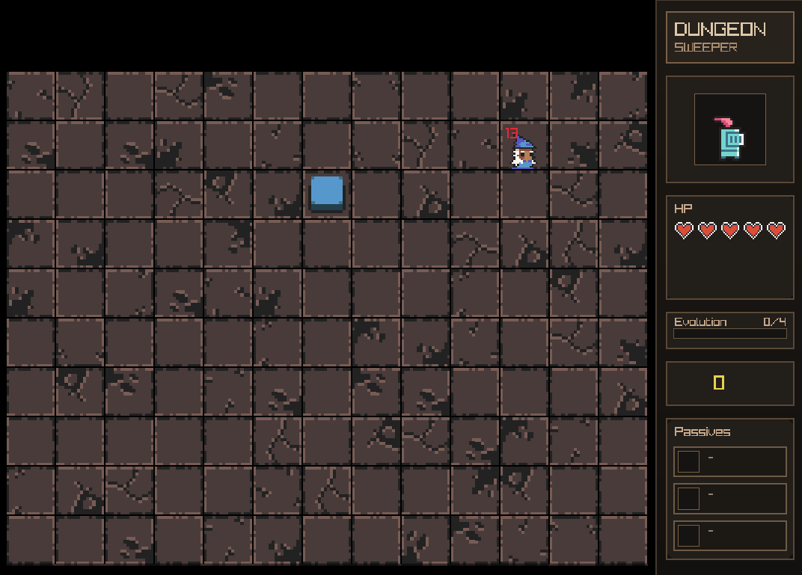

# DungeonSweeper


<p align="center">
  <strong>Welcome to DungeonSweeper. An 2D minesweeper like game using C++ and Raylib.</strong>
</p>

## Play in Browser

You don't need to build the project to try it out! You can play the WebAssembly version directly in your browser

<p align="center">
  <strong><a href="https://ASOM846.github.io/Dungeonsweeper/">Play DungeonSweeper</a></strong>
</p>

## Screenshots



## Gameplay

### Goal of the game

Defeat wizzard in possibly the shortest time

### Game modes

Currently, the game features only 3 modes.
So far, the only difference between them is the spawn rate of pickups
and enemies.
Each mode except for standard gameplay also features timed challenge mode.

### Controls

Navigation is done using the mouse. In-game,
the left mouse button interacts with cells,
while the right mouse button opens the flag menu, where you can flag cells.

## Building the project

```
  sudo pacman -Syu --needed git base-devel cmake ninja ccache sccache pkgconf raylib
  git clone https://github.com/ASOM846/Dungeonsweeper.git
  cd Dungeonsweeper
  cmake -S . -B build -G Ninja
  cmake --build build --parallel $(nproc)
```

Copy assets folder to your build directory and run

`./build/mineswepper`

## To-Do

### High priority

#### Code

- [x] Popup flag menu
- [x] Fix web build

#### Gameplay

- [x] Working passive abilities
- [ ] Add more passive abilities
- [ ] Score saving
- [ ] Time Chalange (almost working)
- [ ] Time adding item for Chalange Modes
- [ ] Random enemies with special abilities that might or might not spawn
- [ ] Daily challange based on current date!!!
- [ ] Seed displaying at the end of game
- [ ] Own seed game

---

### Low priority

#### Code

- [ ] Change hardcoded values to const
- [ ] Change if statements to switch cases in grid managers

#### Gameplay

- [ ] Different bosses/modes
- [ ] Quests

## Bugs

- [x] Clicks are counted when changing grids
